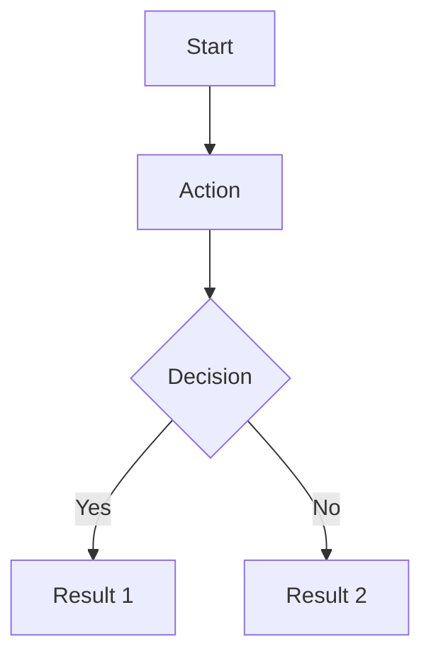

# Feature: [Feature Name]

<!--
This template helps document new features for the Filmz2 app.
Replace all placeholders in square brackets with actual content.
Remove this comment block when using the template.
-->

## Overview

[Brief description of what this feature does and its purpose in the app]

## User Story

**As a** [type of user]  
**I want to** [what they want to do]  
**So that** [why they want to do it / the benefit]

## Acceptance Criteria

- [ ] [First measurable criteria for feature completion]
- [ ] [Second criteria]
- [ ] [Additional criteria as needed]

## Visual Design

### Layout Structure

```text
[ASCII art or text diagram showing the UI layout]
```

### UI Components

1. **[Component Name]**

   - [Description of component]
   - [Visual properties]
   - [Behavior/interactions]

2. **[Component Name]**
   - [Description]
   - [Properties]

### Design Specifications

- **Color Scheme**: [Primary colors, accent colors]
- **Typography**: [Font styles and sizes]
- **Spacing**: [Padding and margin guidelines]
- **Animations**: [Any transitions or animations]

## Technical Implementation

### Data Models

```swift
// Example data structure
struct [ModelName] {
    let property: Type
}
```

### API Requirements

- **Endpoint**: `[API endpoint if applicable]`
- **Method**: `[GET/POST/etc.]`
- **Parameters**:
  - `param1`: [description]
  - `param2`: [description]
- **Response Format**: [JSON structure or description]

### Architecture

- **View**: `[ViewName]View.swift`
- **ViewModel**: `[ViewName]ViewModel.swift`
- **Service**: `[ServiceName]Service.swift` (if needed)

### Dependencies

- [ ] [External library or framework]
- [ ] [Internal component or service]

## User Flow

1. [First step in user journey]
2. [Second step]
3. [Continue describing the flow]



## Edge Cases

1. **[Edge Case Name]**

   - Scenario: [When this happens]
   - Expected behavior: [What should happen]

2. **[Edge Case Name]**
   - Scenario: [Description]
   - Expected behavior: [Description]

## Testing Requirements

### Unit Tests

- [ ] Test [specific functionality]
- [ ] Test error handling for [scenario]
- [ ] Test data validation

### UI Tests

- [ ] Test navigation to/from feature
- [ ] Test user interactions
- [ ] Test accessibility

### Test Data

```swift
// Example test data
static let testData = [ModelName](
    property: "test value"
)
```

## Accessibility

- [ ] VoiceOver support with descriptive labels
- [ ] Dynamic Type support
- [ ] Sufficient color contrast (WCAG AA)
- [ ] Keyboard navigation (if applicable)

## Performance Considerations

- **Loading**: [How to handle loading states]
- **Caching**: [What data should be cached]
- **Memory**: [Any memory management concerns]
- **Network**: [Offline behavior, retry logic]

## Security Considerations

- [ ] [Any security requirements]
- [ ] [Data privacy concerns]
- [ ] [Authentication/authorization needs]

## Analytics

Track the following events:

- [ ] `[event_name]`: When [trigger description]
- [ ] `[event_name]`: When [trigger description]

## Future Enhancements

- [ ] [Potential improvement for v2]
- [ ] [Nice-to-have feature]
- [ ] [Long-term consideration]

## Definition of Done

- [ ] Code implemented and follows coding guidelines
- [ ] Unit tests written and passing (>80% coverage)
- [ ] UI tests implemented
- [ ] Code reviewed and approved
- [ ] Documentation updated
- [ ] Accessibility verified
- [ ] Performance benchmarks met
- [ ] Feature tested on physical device
- [ ] Analytics events implemented

## References

- [Link to design mockups]
- [Link to API documentation]
- [Link to related ADRs]

---

**Status**: [Draft | In Review | Approved | Implemented]  
**Created**: [YYYY-MM-DD]  
**Updated**: [YYYY-MM-DD]  
**Author**: [Your Name]
